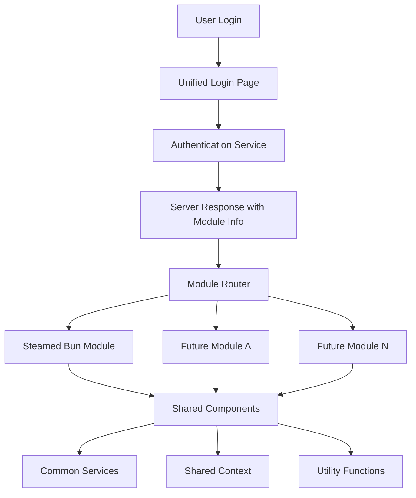
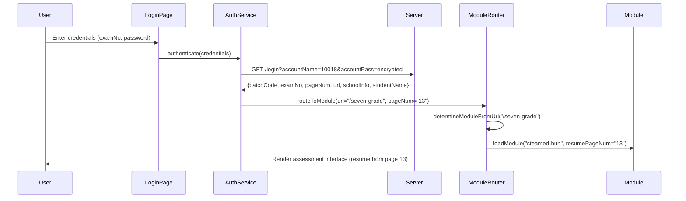
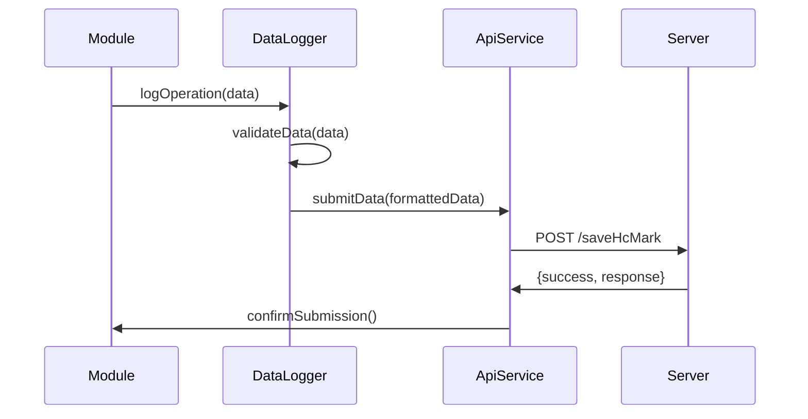

# Design Document

## Overview

This document outlines the architectural design for refactoring the current single-module steamed bun assessment application into a multi-module system that can support multiple educational assessment types while maintaining a unified login system and shared infrastructure.

The design leverages React's component-based architecture to create a modular, scalable system where each assessment module operates independently while sharing common components, services, and authentication mechanisms. The solution uses server-driven routing to determine which assessment module a user should access based on their login credentials.

## Architecture

### High-Level Architecture



### Directory Structure Design

```
src/
├── core/                          # Core application infrastructure
│   ├── components/                # Shared UI components
│   │   ├── common/               # Basic UI components (Button, Modal, etc.)
│   │   ├── navigation/           # Navigation components
│   │   └── layout/               # Layout components
│   ├── services/                 # Shared API services
│   │   ├── apiService.js        # Core API functionality
│   │   ├── authService.js       # Authentication logic
│   │   └── dataLogging.js       # Data logging services
│   ├── context/                 # Global context providers
│   │   ├── AuthContext.jsx      # Authentication state
│   │   └── AppContext.jsx       # Core app state
│   ├── hooks/                   # Shared custom hooks
│   ├── utils/                   # Utility functions
│   └── config/                  # Configuration files
├── modules/                      # Assessment modules
│   ├── steamed-bun/             # Seven-grade steamed bun assessment (/seven-grade)
│   │   ├── components/          # Module-specific components
│   │   ├── pages/               # Module pages (P0-P28)
│   │   ├── context/             # Module-specific context
│   │   ├── utils/               # Module utilities (pageMappings.js, etc.)
│   │   ├── config/              # Module configuration
│   │   │   └── moduleConfig.js  # Page mappings and URL config
│   │   └── index.js             # Module entry point
│   ├── eight-grade/             # Future eight-grade module (/eight-grade)
│   ├── nine-grade/              # Future nine-grade module (/nine-grade)
│   └── module-registry.js       # Module registration and URL mapping
├── App.jsx                      # Main application component
├── ModuleRouter.jsx             # Module routing component (URL-based routing)
└── main.jsx                     # Application entry point
```

## Components and Interfaces

### Module Interface Contract

Each assessment module must implement a standardized interface to ensure compatibility with the core system:

```javascript
// Module Interface Definition
export interface AssessmentModule {
  moduleId: string;                    // Unique module identifier
  displayName: string;                 // Human-readable name
  version: string;                     // Module version
  
  // Required exports
  ModuleComponent: React.Component;    // Main module component
  moduleConfig: ModuleConfig;          // Module configuration
  
  // Optional exports
  moduleContext?: React.Context;       // Module-specific context
  moduleUtils?: object;                // Module utilities
}

// Module Configuration
export interface ModuleConfig {
  routes: RouteConfig[];              // Module route definitions
  requiredPermissions?: string[];     // Required user permissions
  apiEndpoints: ApiEndpointConfig[];  // Module-specific API endpoints
  timers?: TimerConfig[];             // Timer configurations
  dataSchema: DataSchema;             // Data submission schema
}
```

### Core Components Architecture

#### 1. Unified Authentication System

**AuthContext.jsx** - Manages global authentication state
```javascript
const AuthContext = {
  // Authentication state
  isAuthenticated: boolean,
  currentUser: User,
  
  // Authentication methods
  login: (credentials) => Promise<LoginResponse>,
  logout: () => void,
  refreshSession: () => Promise<void>,
  
  // Module routing data (from server response)
  assignedModuleUrl: string,     // e.g., "/seven-grade"
  currentPageNum: string,        // e.g., "13" - for resume functionality
  
  // School and batch context
  schoolInfo: {
    schoolCode: string,
    schoolName: string
  },
  batchCode: string
}
```

**LoginPage.jsx** - Enhanced to support module routing
- Maintains existing UI and authentication flow
- Enhanced server response parsing for module assignment
- Automatic redirection to assigned assessment module

#### 2. Module Router System

**ModuleRouter.jsx** - Central module routing component
```javascript
const ModuleRouter = {
  // Core functionality
  determineModuleFromUrl: (url) => string,    // e.g., "/seven-grade" -> "steamed-bun"
  loadModule: (moduleId) => Promise<Module>,
  renderModule: (module, userContext) => React.Element,
  
  // Resume functionality (using existing logic)
  initializeModuleAtPage: (pageNum, moduleId) => string,  // Use existing getTargetPageIdFromPageNum
  
  // Error handling
  handleModuleError: (error, moduleId, url) => void,
  fallbackComponent: React.Component
}
```

**module-registry.js** - Dynamic module registration
```javascript
const ModuleRegistry = {
  // Module registration
  registerModule: (moduleId, moduleDefinition) => void,
  getModule: (moduleId) => Module,
  getModuleByUrl: (url) => Module,              // New: Get module by URL path
  listModules: () => Module[],
  validateModule: (module) => boolean,
  
  // URL mapping
  urlToModuleMap: {
    "/seven-grade": "steamed-bun",              // Current mapping
    "/eight-grade": "future-module-a",          // Future modules
    "/nine-grade": "future-module-b"
  }
}
```

#### 3. Shared Component Library

**Core Components:**
- **Button, Modal, TextInput** - Existing common UI components
- **Timer, UserInfoBar** - Shared across all modules
- **NavigationSystem** - Modular navigation supporting different flows
- **DataLogger** - Centralized logging for all modules

**Layout Components:**
- **ModuleLayout** - Standard layout wrapper for all modules
- **PageTransition** - Consistent page transition animations
- **ErrorBoundary** - Module-level error handling

### Data Flow Architecture

#### Authentication Flow


#### Data Logging Flow


## Data Models

### User Authentication Model
```javascript
interface User {
  batchCode: string;        // Assessment batch code (e.g., "250619")
  examNo: string;           // Student exam number/account (e.g., "10018")
  pageNum: string;          // Last completed page number (e.g., "13")
  pwd: string;              // Password (for re-authentication if needed)
  schoolCode: string;       // School identifier (e.g., "24146")
  schoolName: string;       // School display name (e.g., "成都市新都区龙安小学校（中心）")
  studentCode: string;      // Student code (may be empty)
  studentName: string;      // Student display name (e.g., "7 年级测试 71")
  url: string;              // Module routing URL (e.g., "/seven-grade")
  
  // Extended session data
  sessionData: {
    loginTime: Date;
    sessionId: string;
    lastActivity: Date;
  }
}
```

### Module Configuration Model
```javascript
interface ModuleConfig {
  moduleId: string;          // e.g., "steamed-bun"
  displayName: string;       // e.g., "蒸馒头科学探究测评"
  version: string;
  url: string;               // e.g., "/seven-grade"
  
  // Page configuration with pageNum mapping
  pages: {
    [pageId: string]: {
      number: string;         // Maps to pageNum from server (e.g., "13")
      desc: string;           // Page description for logging
      stepNumber: number;     // Display step number
      isInProgress: boolean;  // Whether page counts toward progress
      component: string;      // Component name
    }
  };
  
  // Page number to page ID mapping (for resume functionality)
  pageNumMapping: {
    [pageNum: string]: string;  // e.g., "13" -> "Page_13_Transition_To_Simulation"
  };
  
  // Timer configuration
  timers: {
    mainTask: number;        // Main task duration (seconds)
    questionnaire?: number;  // Questionnaire duration (optional)
  };
  
  // API endpoints (shared across modules)
  apiEndpoints: {
    login: "/login",
    saveHcMark: "/saveHcMark"
  };
}
```

### Data Logging Model
```javascript
interface LogEntry {
  batchCode: string;         // From login response (e.g., "250619")
  examNo: string;            // From login response (e.g., "10018")
  mark: {
    pageNumber: string;      // Page number for backend (e.g., "13")
    pageDesc: string;        // Page description
    operationList: Operation[];
    answerList: Answer[];
    beginTime: string;       // ISO datetime string
    endTime: string;         // ISO datetime string
    imgList: string[];       // Usually empty array
  }
}

interface Operation {
  targetElement: string;     // UI element description
  eventType: string;         // e.g., 'click', 'input', '查看资料'
  value?: string;            // Input value or interaction data
  timestamp: string;         // ISO datetime string
  elementId?: string;        // DOM element ID (optional)
}

interface Answer {
  questionId: string;        // Question identifier
  answer: string;            // User's answer
  timestamp: string;         // When answer was given
}
```

## Error Handling

### Module-Level Error Handling

**Error Boundary Strategy:**
- Each module wrapped in ErrorBoundary component
- Graceful degradation when module fails to load
- Error reporting to centralized logging system
- User-friendly error messages with retry mechanisms

**Error Types and Handling:**
1. **Module Load Failures** - Fallback to error page with retry option
2. **Authentication Failures** - Redirect to login with error message
3. **API Communication Errors** - Retry logic with exponential backoff
4. **Data Validation Errors** - Inline validation with clear feedback
5. **Session Expiration** - Automatic re-authentication with state preservation

### Resilience Patterns

**Circuit Breaker Pattern:**
- Prevent cascading failures when API endpoints are down
- Automatic recovery when services become available
- Graceful degradation of non-critical features

**Retry Mechanism:**
- Exponential backoff for API requests
- Maximum retry limits to prevent infinite loops
- User notification for persistent failures

## Testing Strategy

### Testing Architecture

#### Unit Testing
- **Component Testing** - Individual component behavior and rendering
- **Service Testing** - API service functions and error handling  
- **Utility Testing** - Helper functions and data transformations
- **Hook Testing** - Custom hooks behavior and state management

#### Integration Testing
- **Module Integration** - Module loading and routing functionality
- **Authentication Flow** - End-to-end login and module routing
- **Data Flow** - Operation logging and data submission
- **API Integration** - Service communication with backend

#### E2E Testing Framework
```javascript
// Module-agnostic E2E test structure
describe('Multi-Module Assessment System', () => {
  test('User can login and be routed to correct module', async () => {
    // Test authentication and routing
  });
  
  test('Module can complete full assessment flow', async () => {
    // Test module-specific workflows
  });
  
  test('System handles module failures gracefully', async () => {
    // Test error handling and recovery
  });
});
```

#### Testing Configuration
- **Jest** - Unit and integration testing framework (existing)
- **React Testing Library** - Component testing utilities
- **MSW (Mock Service Worker)** - API mocking for testing
- **Playwright/Cypress** - E2E testing framework

### Module Testing Standards

Each module must include:
1. **Component Tests** - All page components and UI interactions
2. **Integration Tests** - Module lifecycle and data flow
3. **Accessibility Tests** - WCAG compliance validation
4. **Performance Tests** - Loading time and memory usage benchmarks

## Migration Strategy

### Phase 1: Core Infrastructure Setup
1. **Extract Shared Components** - Move common components to core/components
2. **Create Module Interface** - Define and implement module contract
3. **Refactor Authentication** - Extract auth logic to core services
4. **Setup Module Registry** - Implement dynamic module loading system

### Phase 2: Steamed Bun Module Migration  
1. **Create Module Structure** - Organize existing code into module format
2. **Update Page Components** - Modify imports to use shared components
3. **Migrate Context Logic** - Move module-specific state to module context
4. **Update Routing** - Integrate with new module router system

### Phase 3: System Integration
1. **Implement Module Router** - Connect all systems together
2. **Update API Services** - Ensure compatibility with module system
3. **Testing Integration** - Run comprehensive test suite
4. **Performance Optimization** - Bundle optimization and lazy loading

### Phase 4: Future Module Support
1. **Documentation** - Create module development guidelines
2. **Development Tools** - Module scaffolding and validation tools
3. **CI/CD Integration** - Automated testing and deployment
4. **Monitoring Setup** - Module performance and error tracking

### Backward Compatibility

**API Compatibility:**
- All existing API endpoints maintain same interface
- Data formats and field names remain unchanged
- RSA encryption and authentication flows preserved

**Build Process:**
- Existing npm scripts continue to work
- Vite configuration remains compatible
- Development workflow unchanged for existing features

**Deployment:**
- Same build output structure and deployment process
- Environment variable configuration preserved
- Production API routing maintains current behavior