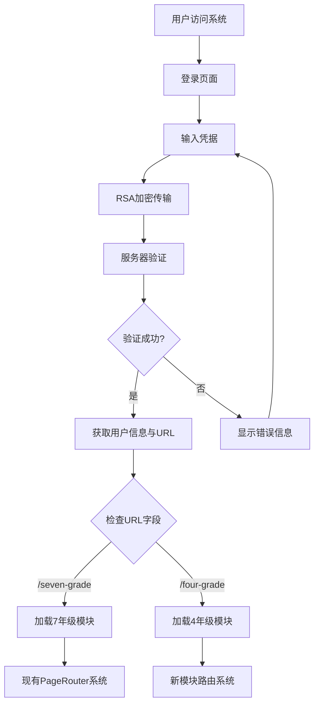
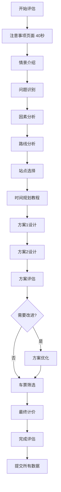

# **核心工作流程规范 (Core Workflows Specification)**

## **工作流程概述 (Workflow Overview)**

本文档定义了用户在评估系统中的核心操作流程，包括页面导航、数据收集、状态管理和提交逻辑的完整工作流。

## **1. 主要工作流程 (Primary Workflows)**

### **1.1 用户认证与模块路由流程**



### **1.2 页面生命周期工作流程**

```javascript
// 标准页面生命周期
const PageLifecycle = {
  // 1. 页面初始化
  onPageMount: () => {
    // 记录页面进入时间
    setPageEnterTime(new Date());
    
    // 记录进入操作
    logOperation({
      targetElement: '页面',
      eventType: 'page_enter',
      value: `进入页面${currentPageId}`
    });
    
    // 恢复页面状态（如果有）
    restorePageState();
  },
  
  // 2. 用户交互处理
  onUserInteraction: (interaction) => {
    // 实时记录操作
    logOperation({
      targetElement: interaction.element,
      eventType: interaction.type,
      value: interaction.value
    });
    
    // 更新UI状态
    updateUIState(interaction);
    
    // 如果是答案，收集答案
    if (interaction.isAnswer) {
      collectAnswer({
        targetElement: interaction.questionId,
        value: interaction.value
      });
    }
  },
  
  // 3. 页面退出处理
  onPageExit: async () => {
    // 设置页面退出时间
    const exitTime = new Date();
    
    // 记录退出操作
    logOperation({
      targetElement: '页面',
      eventType: 'page_exit',
      value: `离开页面${currentPageId}`
    });
    
    // 构造并提交页面数据
    const markObject = buildMarkObject(
      currentPageId,
      pageDescription,
      collectedOperations,
      collectedAnswers,
      pageEnterTime,
      exitTime
    );
    
    // 提交到后端
    await submitPageData(markObject);
    
    // 清理当前页面状态
    cleanupPageState();
  }
};
```

## **2. 4年级模块特定工作流程 (Grade-4 Specific Workflows)**

### **2.1 完整评估流程**



### **2.2 拖拽交互工作流程**

```javascript
// 拖拽任务规划工作流程
const DragDropWorkflow = {
  // 1. 拖拽开始
  onDragStart: (task) => {
    logOperation({
      targetElement: '任务块',
      eventType: 'drag_start',
      value: `开始拖拽${task.name}`
    });
    
    // 显示拖拽提示
    showDropZoneHighlights();
  },
  
  // 2. 拖拽过程
  onDragOver: (position) => {
    // 显示预览位置
    showPreviewPosition(position);
    
    // 检查放置有效性
    validateDropPosition(position);
  },
  
  // 3. 拖拽放置
  onDrop: (task, position) => {
    // 验证放置位置
    if (!isValidDropPosition(position)) {
      showErrorMessage('此位置无法放置任务');
      return;
    }
    
    // 记录放置操作
    logOperation({
      targetElement: '时间轴',
      eventType: 'task_drop',
      value: `将${task.name}放置在${position.startTime}分钟处`
    });
    
    // 更新任务排列
    const newArrangement = addTaskToTimeline(task, position);
    updateTaskArrangement(newArrangement);
    
    // 自动计算关键路径
    const criticalPath = calculateCriticalPath(newArrangement);
    updateCriticalPathDisplay(criticalPath);
  },
  
  // 4. 方案完成
  onSchemeComplete: (scheme) => {
    // 收集最终答案
    collectAnswer({
      targetElement: '时间方案',
      value: {
        tasks: scheme.tasks,
        arrangementPattern: scheme.pattern,
        userEstimatedTime: scheme.userInput
      }
    });
    
    // 截图保存
    captureSchemeScreenshot(scheme.id);
  }
};
```

### **2.3 地图交互工作流程**

```javascript
// 交互式地图工作流程
const MapInteractionWorkflow = {
  // 1. 路线选择
  onRouteSelect: (routeId) => {
    logOperation({
      targetElement: '路线选择按钮',
      eventType: 'click',
      value: `选择查看${routeId}`
    });
    
    // 切换地图显示
    displayRouteMap(routeId);
    
    // 显示距离输入区域
    showDistanceInput(routeId);
  },
  
  // 2. 距离计算
  onDistanceInput: (routeId, distance) => {
    logOperation({
      targetElement: '距离输入框',
      eventType: 'input',
      value: `${routeId}距离: ${distance}km`
    });
    
    // 实时验证输入
    validateDistanceInput(distance);
    
    // 更新计算结果
    updateRouteCalculation(routeId, distance);
  },
  
  // 3. 路线比较
  onRouteComparison: () => {
    const allRoutes = getAllRouteData();
    
    logOperation({
      targetElement: '路线比较',
      eventType: 'calculation',
      value: `比较路线: ${JSON.stringify(allRoutes)}`
    });
    
    // 显示比较结果
    displayComparisonResults(allRoutes);
  }
};
```

### **2.4 计价系统工作流程**

```javascript
// 自定义键盘计价工作流程
const CalculationWorkflow = {
  // 1. 车次选择
  onTrainSelect: (trainId) => {
    logOperation({
      targetElement: '车次选择',
      eventType: 'radio_select',
      value: trainId
    });
    
    // 更新价格信息
    updatePriceDisplay(trainId);
    
    // 启用计算功能
    enableCalculation();
  },
  
  // 2. 公式输入
  onFormulaInput: (key, currentFormula) => {
    logOperation({
      targetElement: '计算键盘',
      eventType: 'key_press',
      value: key
    });
    
    // 更新公式显示
    const newFormula = processKeyInput(key, currentFormula);
    updateFormulaDisplay(newFormula);
    
    // 实时验证公式
    validateFormula(newFormula);
  },
  
  // 3. 计算执行
  onCalculate: (formula) => {
    logOperation({
      targetElement: '等号按钮',
      eventType: 'click',
      value: `计算公式: ${formula}`
    });
    
    try {
      // 安全计算
      const result = safeCalculate(formula);
      
      // 显示结果
      displayCalculationResult(result);
      
      // 收集答案
      collectAnswer({
        targetElement: '计价公式',
        value: formula
      });
      
      collectAnswer({
        targetElement: '计算结果',
        value: result
      });
      
    } catch (error) {
      showCalculationError(error);
    }
  },
  
  // 4. 理由说明
  onJustificationInput: (justification) => {
    logOperation({
      targetElement: '理由输入框',
      eventType: 'textarea_input',
      value: justification
    });
    
    // 实时保存
    autoSaveJustification(justification);
  }
};
```

## **3. 数据流工作流程 (Data Flow Workflows)**

### **3.1 数据收集与转换流程**

```javascript
// 数据收集转换工作流程
const DataCollectionWorkflow = {
  // 1. 实时数据收集
  collectUserInteraction: (interaction) => {
    // 添加到操作列表
    addToOperationList({
      code: getNextOperationCode(),
      targetElement: interaction.element,
      eventType: interaction.type,
      value: interaction.value,
      time: formatTimestamp(new Date())
    });
    
    // 如果是答案，添加到答案列表
    if (interaction.isAnswer) {
      addToAnswerList({
        code: getNextAnswerCode(),
        targetElement: interaction.questionId,
        value: interaction.value
      });
    }
  },
  
  // 2. 页面数据整合
  buildPageMarkObject: (pageInfo) => {
    return {
      pageNumber: pageInfo.number.toString(),
      pageDesc: pageInfo.description,
      operationList: getCollectedOperations(),
      answerList: getCollectedAnswers(),
      beginTime: formatTimestamp(pageInfo.enterTime),
      endTime: formatTimestamp(new Date()),
      imgList: getPageScreenshots()
    };
  },
  
  // 3. 数据验证
  validateMarkObject: (markObject) => {
    const validations = [
      validateRequiredFields(markObject),
      validateTimestampFormat(markObject),
      validateSequentialCodes(markObject),
      validateDataTypes(markObject)
    ];
    
    return validations.every(v => v.isValid);
  },
  
  // 4. 数据提交
  submitPageData: async (markObject) => {
    try {
      // 构造FormData
      const formData = new FormData();
      formData.append('batchCode', userContext.batchCode);
      formData.append('examNo', userContext.examNo);
      formData.append('mark', JSON.stringify(markObject));
      
      // 提交到后端
      const response = await apiService.submitPageMarkData(formData);
      
      // 处理响应
      handleSubmissionResponse(response);
      
    } catch (error) {
      handleSubmissionError(error);
    }
  }
};
```

### **3.2 状态持久化工作流程**

```javascript
// 状态持久化工作流程
const StatePersistenceWorkflow = {
  // 1. 自动保存
  autoSave: debounce((state) => {
    localStorage.setItem(`grade4State_${userContext.examNo}`, JSON.stringify({
      ...state,
      lastSaved: new Date().toISOString()
    }));
  }, 1000),
  
  // 2. 状态恢复
  restoreState: () => {
    const savedState = localStorage.getItem(`grade4State_${userContext.examNo}`);
    if (savedState) {
      const parsed = JSON.parse(savedState);
      
      // 验证状态有效性
      if (isStateValid(parsed)) {
        return parsed;
      }
    }
    
    return getInitialState();
  },
  
  // 3. 跨页面状态同步
  syncStateAcrossPages: (newState) => {
    // 更新本地状态
    updateLocalState(newState);
    
    // 持久化到localStorage
    autoSave(newState);
    
    // 通知其他组件状态变更
    notifyStateChange(newState);
  },
  
  // 4. 清理过期状态
  cleanupExpiredStates: () => {
    const keys = Object.keys(localStorage);
    const grade4Keys = keys.filter(key => key.startsWith('grade4State_'));
    
    grade4Keys.forEach(key => {
      const state = JSON.parse(localStorage.getItem(key));
      const lastSaved = new Date(state.lastSaved);
      const now = new Date();
      
      // 清理超过24小时的状态
      if (now - lastSaved > 24 * 60 * 60 * 1000) {
        localStorage.removeItem(key);
      }
    });
  }
};
```

## **4. 错误处理工作流程 (Error Handling Workflows)**

### **4.1 网络错误处理**

```javascript
// 网络错误处理工作流程
const ErrorHandlingWorkflow = {
  // 1. 提交失败重试
  handleSubmissionFailure: async (markObject, error) => {
    const retryCount = getRetryCount(markObject.pageNumber);
    
    if (retryCount < 3) {
      // 指数退避重试
      const delay = Math.pow(2, retryCount) * 1000;
      
      setTimeout(async () => {
        try {
          incrementRetryCount(markObject.pageNumber);
          await submitPageData(markObject);
          clearRetryCount(markObject.pageNumber);
        } catch (retryError) {
          handleSubmissionFailure(markObject, retryError);
        }
      }, delay);
    } else {
      // 保存到本地，稍后重试
      saveFailedSubmission(markObject);
      showUserNotification('数据将在网络恢复后自动重试提交');
    }
  },
  
  // 2. 会话过期处理
  handleSessionExpiration: () => {
    // 保存当前状态
    saveCurrentState();
    
    // 显示重新登录对话框
    showReLoginDialog();
    
    // 重新认证后恢复状态
    onReAuthenticated(() => {
      restoreCurrentState();
      retryFailedSubmissions();
    });
  },
  
  // 3. 数据验证失败处理
  handleValidationFailure: (validationErrors) => {
    // 记录验证错误
    console.error('数据验证失败:', validationErrors);
    
    // 显示用户友好的错误信息
    showValidationErrors(validationErrors);
    
    // 阻止页面切换
    preventPageNavigation();
    
    // 高亮错误字段
    highlightErrorFields(validationErrors);
  }
};
```

### **4.2 用户操作错误处理**

```javascript
// 用户操作错误处理
const UserErrorHandling = {
  // 1. 无效拖拽处理
  handleInvalidDrop: (task, position) => {
    // 显示错误提示
    showDropError('任务无法放置在此位置，请检查时间冲突');
    
    // 任务回弹动画
    animateTaskReturn(task);
    
    // 记录错误操作
    logOperation({
      targetElement: '拖拽操作',
      eventType: 'drop_error',
      value: `无效放置: ${task.name} 在 ${position.startTime}`
    });
  },
  
  // 2. 计算错误处理
  handleCalculationError: (formula, error) => {
    // 显示计算错误
    showCalculationError('公式格式不正确，请检查');
    
    // 高亮错误部分
    highlightFormulaError(formula);
    
    // 提供修正建议
    suggestFormulaCorrection(formula);
  },
  
  // 3. 输入验证错误
  handleInputValidationError: (field, value, rule) => {
    // 显示字段特定错误
    showFieldError(field, rule.message);
    
    // 聚焦到错误字段
    focusErrorField(field);
    
    // 记录验证错误
    logOperation({
      targetElement: field,
      eventType: 'validation_error',
      value: `输入值: ${value}, 规则: ${rule.name}`
    });
  }
};
```

## **5. 定时器与超时处理 (Timer and Timeout Handling)**

### **5.1 评估定时器工作流程**

```javascript
// 定时器管理工作流程
const TimerWorkflow = {
  // 1. 定时器初始化
  initializeTimer: (duration) => {
    const timer = {
      startTime: new Date(),
      duration: duration * 60 * 1000, // 转换为毫秒
      remaining: duration * 60 * 1000,
      isActive: true
    };
    
    // 开始倒计时
    startCountdown(timer);
    
    // 保存定时器状态
    saveTimerState(timer);
    
    return timer;
  },
  
  // 2. 定时器更新
  updateTimer: (timer) => {
    if (!timer.isActive) return timer;
    
    const now = new Date();
    const elapsed = now - timer.startTime;
    const remaining = Math.max(0, timer.duration - elapsed);
    
    const updatedTimer = {
      ...timer,
      remaining: remaining,
      isActive: remaining > 0
    };
    
    // 更新UI显示
    updateTimerDisplay(updatedTimer);
    
    // 检查警告阈值
    checkWarningThresholds(updatedTimer);
    
    return updatedTimer;
  },
  
  // 3. 超时处理
  handleTimeout: () => {
    // 停止所有用户交互
    disableUserInteractions();
    
    // 自动提交当前页面
    forceSubmitCurrentPage();
    
    // 跳转到超时页面
    navigateToTimeoutPage();
    
    // 记录超时事件
    logOperation({
      targetElement: '系统',
      eventType: 'timeout',
      value: '评估时间超时'
    });
  },
  
  // 4. 警告提醒
  showTimeWarnings: (remainingTime) => {
    const minutes = Math.floor(remainingTime / 60000);
    
    if (minutes === 5) {
      showWarningModal('还剩5分钟，请抓紧时间完成');
    } else if (minutes === 1) {
      showCriticalWarning('还剩1分钟，系统即将自动提交');
    } else if (remainingTime < 30000) {
      showFinalCountdown(remainingTime);
    }
  }
};
```

## **6. 模块路由工作流程 (Module Routing Workflows)**

### **6.1 模块切换工作流程**

```javascript
// 模块路由工作流程
const ModuleRoutingWorkflow = {
  // 1. 模块判断
  determineModule: (userContext) => {
    const moduleUrl = userContext.url;
    const moduleMapping = {
      '/seven-grade': 'grade-7',
      '/four-grade': 'grade-4'
    };
    
    return moduleMapping[moduleUrl] || 'grade-7'; // 默认7年级
  },
  
  // 2. 模块加载
  loadModule: async (moduleId) => {
    try {
      // 显示加载状态
      showModuleLoading(moduleId);
      
      // 动态导入模块
      const module = await import(`../modules/${moduleId}/index.jsx`);
      
      // 初始化模块上下文
      initializeModuleContext(moduleId);
      
      // 渲染模块
      renderModule(module.default);
      
      // 隐藏加载状态
      hideModuleLoading();
      
    } catch (error) {
      handleModuleLoadError(moduleId, error);
    }
  },
  
  // 3. 模块切换
  switchModule: async (fromModule, toModule) => {
    // 保存当前模块状态
    await saveModuleState(fromModule);
    
    // 卸载当前模块
    unloadModule(fromModule);
    
    // 加载新模块
    await loadModule(toModule);
    
    // 恢复新模块状态
    restoreModuleState(toModule);
  },
  
  // 4. 模块错误恢复
  handleModuleError: (moduleId, error) => {
    console.error(`模块 ${moduleId} 错误:`, error);
    
    // 回退到默认模块
    if (moduleId !== 'grade-7') {
      loadModule('grade-7');
    } else {
      // 显示系统错误页面
      showSystemErrorPage();
    }
  }
};
```

## **7. 完整用户旅程示例 (Complete User Journey Example)**

### **7.1 典型4年级评估流程**

```javascript
// 完整的4年级评估用户旅程
const Grade4AssessmentJourney = {
  // 开始评估
  startAssessment: async () => {
    // 1. 初始化
    await initializeGrade4Module();
    
    // 2. 开始40分钟定时器
    const timer = initializeTimer(40);
    
    // 3. 显示注意事项页面
    await showOnboardingPage(40); // 40秒强制等待
    
    // 4. 开始正式评估
    navigateToPage('scenario-intro');
  },
  
  // 问题识别阶段
  problemIdentificationPhase: async () => {
    await processPage('problem-identification', {
      requiredFields: ['problemStatement'],
      minLength: 20
    });
  },
  
  // 因素分析阶段
  factorAnalysisPhase: async () => {
    await processPage('factor-analysis', {
      requiredFields: ['relevantFactors'],
      minSelections: 3
    });
  },
  
  // 路线分析阶段
  routeAnalysisPhase: async () => {
    await processPage('route-analysis', {
      requiredFields: ['route1_km', 'route5_km'],
      validationRules: {
        route1_km: { min: 1, max: 1000 },
        route5_km: { min: 1, max: 1000 }
      }
    });
  },
  
  // 时间规划阶段
  timePlanningPhase: async () => {
    // 方案1设计
    await processTimePlanning('scheme1');
    
    // 方案2设计
    await processTimePlanning('scheme2');
    
    // 方案评估
    const needsOptimization = await processSchemeEvaluation();
    
    if (needsOptimization) {
      await processTimePlanning('improvement');
    }
  },
  
  // 最终购票阶段
  finalPurchasePhase: async () => {
    await processPage('ticket-purchase', {
      requiredFields: ['selectedTrain', 'calculatedTotal', 'justification'],
      validationRules: {
        calculatedTotal: { min: 0 },
        justification: { minLength: 10 }
      }
    });
  },
  
  // 完成评估
  completeAssessment: async () => {
    // 提交所有数据
    await submitAllPageData();
    
    // 停止定时器
    stopTimer();
    
    // 显示完成页面
    showCompletionPage();
    
    // 清理状态
    cleanupAssessmentState();
  }
};
```
# **8.0 用户流程 (User Flows) - 完整功能规格**

本章节将完整、顺序地定义"火车购票"模块从开始到结束的所有用户流程。每个子流程都将提供详尽的交互步骤和状态图，作为前端开发的精确指南。

## **8.1 流程一：测评引导与情景建立**

### **8.1.1 子流程：强制阅读与确认 - 注意事项页面**

* **用户目标**: 理解并同意测评的核心规则，特别是时间限制和单向流程。  
* **对应导航项**: 无 (此页面在主导航出现前)。  
* **页面内容**: 测评注意事项说明文本，包含时间限制、操作规则等重要信息。
* **交互状态图 (Mermaid Diagram)**:  
  ```mermaid
  stateDiagram-v2  
      [*] --> TimerRunning: 页面加载  
      TimerRunning: 复选框禁用, 计时器(40s)启动  
      TimerRunning --> CheckboxEnabled: 计时器结束  
      CheckboxEnabled: 复选框可用  
      CheckboxEnabled --> Acknowledged: 用户勾选复选框  
      Acknowledged: "下一页"按钮激活  
      Acknowledged --> [*]: 用户点击"下一页"
  ```

* **详细交互步骤**:  
  1. **初始状态**: 页面加载完成。界面风格遵循现有项目样式，内容卡片中显示注意事项文本。"我已阅读并同意以上注意事项"复选框处于**禁用 (disabled)** 状态，"下一页"按钮也处于**禁用**状态。一个40秒的内部计时器启动。  
  2. **用户操作**: 用户等待阅读。  
  3. **系统响应**: 复选框标签中的 (40s) 文本实时倒数更新。  
  4. **状态变更**: 40秒计时结束后，标签中的秒数文本消失，复选框的禁用状态被解除，变为**可用 (enabled)**。  
  5. **用户操作**: 用户点击已启用的复选框。  
  6. **系统响应**: 复选框被选中，显示勾选状态。"下一页"按钮从禁用状态变为**启用 (enabled)**。  
  7. **完成**: 用户点击"下一页"，进入测评的第一个正式题目。此刻，全局的35分钟主计时器正式启动并显示在右上角。

### **8.1.2 子流程：情景代入 - 故事背景介绍**

* **用户目标**: 了解本次测评的故事背景和任务情境。  
* **对应导航项**: "1. 出行方案"应被高亮。  
* **页面内容**: 熊猫背景图片和火车购票情境介绍文本，建立测评的故事情境。
* **交互状态图 (Mermaid Diagram)**:  
  ```mermaid
  stateDiagram-v2  
      [*] --> PageLoaded  
      PageLoaded: "下一页"按钮默认启用  
      PageLoaded --> [*]: 用户点击"下一页"
  ```

* **详细交互步骤**:  
  1. **初始状态**: 页面加载完成。中央内容卡片显示熊猫背景图和引言文本。"下一页"按钮在此页面**默认启用**，因为此页面无作答任务。  
  2. **完成**: 用户阅读后，直接点击"下一页"进入下一步。

### **8.1.3 子流程：问题识别 - 对话分析**

* **用户目标**: 根据对话内容，提炼出小明需要解决的核心问题。  
* **对应导航项**: "2. 出行方案"应被高亮。  
* **页面内容**: 左侧展示"假期安排讨论群"的对话截图，右侧为问题和文本输入区域。
* **交互状态图 (Mermaid Diagram)**:  
  ```mermaid
  stateDiagram-v2  
      [*] --> EmptyInput: 页面加载  
      EmptyInput: 文本框为空, "下一页"按钮禁用  
      EmptyInput --> NonEmptyInput: 用户输入内容  
      NonEmptyInput: 文本框非空, "下一页"按钮激活  
      NonEmptyInput --> EmptyInput: 用户删除所有内容  
      NonEmptyInput --> [*]: 用户点击"下一页"
  ```

* **详细交互步骤**:  
  1. **初始状态**: 页面加载完成。界面左侧显示群聊对话截图，右侧为问题提示和带有占位符的多行文本输入框。"下一页"按钮为**禁用**状态。  
  2. **用户操作**: 用户在文本框中输入文字。  
  3. **系统响应**: 系统实时检测文本框内容。  
  4. **完成条件**: 当文本框经过去除首尾空格后，内容为**非空**字符串时，"下一页"按钮变为**启用**状态。如果用户再次清空文本框，按钮则恢复为禁用状态。

### **8.1.4 子流程：因素分析 - 多选题**

* **用户目标**: 从给定选项中，选择出解决问题需要考虑的相关因素。  
* **对应导航项**: "3. 火车购票"应被高亮。  
* **页面内容**: 问题描述和六个带自定义勾选框的选项，用于多选操作。
* **交互状态图 (Mermaid Diagram)**:  
  ```mermaid
  stateDiagram-v2  
      [*] --> NoSelection: 页面加载  
      NoSelection: 未选择任何选项, "下一页"按钮禁用  
      NoSelection --> HasSelection: 用户选择至少一个选项  
      HasSelection: 已选择至少一项, "下一页"按钮激活  
      HasSelection --> NoSelection: 用户取消所有选择  
      HasSelection --> [*]: 用户点击"下一页"
  ```

* **详细交互步骤**:  
  1. **初始状态**: 页面加载完成。界面显示问题和六个带自定义勾选框的选项。"下一页"按钮为**禁用**状态。  
  2. **用户操作**: 用户点击任意一个选项。  
  3. **系统响应**: 被点击的选项进入"选中"状态（勾选框内出现对勾标记）。  
  4. **用户操作**: 用户再次点击一个已选中的选项。  
  5. **系统响应**: 该选项恢复到"未选中"状态。  
  6. **完成条件**: 当用户**至少选择了一个**选项后，"下一页"按钮变为**启用**状态。如果用户取消了所有已选项，按钮则恢复为禁用状态。

## **8.2 流程二：出发站分析与路线计算**

### **8.2.1 子流程：交互式路线计算 - 动画地图系统**

* **用户目标**: 通过与交互式地图互动，计算出"路线1"和"路线5"的总路程。  
* **对应导航项**: 在此流程期间，左侧导航栏的"4. 火车购票: 出发站"项应始终保持高亮状态。  
* **页面内容**: 三栏布局 - 左侧路线按钮组，中央动画地图区域，右侧路程计算表格。

**核心技术要求：动画脚本实现**
* **重要说明**: 地图的5个方案通过**动画呈现形式**实现，不是分别创建五个页面。需要通过JavaScript脚本构建动画的方式来实现地图切换。
* **动画实现方式**: 
  - 使用CSS动画或JavaScript动画库（如GSAP）
  - 地图图片资源预加载，确保切换流畅
  - 路线高亮动画效果，突出显示当前选中路线
  - 淡入淡出或滑动切换效果

* **交互状态图 (Mermaid Diagram)**:  
  ```mermaid
  stateDiagram-v2  
      [*] --> InitialState: 页面加载  
      InitialState: 显示概览地图, "下一页"按钮禁用  
      InitialState --> RouteSelected: 点击任意路线按钮  
      RouteSelected: 地图动画切换到对应路线详情  
      RouteSelected --> RouteSelected: 点击其他路线按钮  
      RouteSelected --> Validation: 用户在输入框填入数值  
      Validation: 检查"路线1"和"路线5"输入框  
      Validation -->> NextEnabled: 两个输入框均有有效数值  
      NextEnabled: "下一页"按钮激活  
      NextEnabled --> [*]: 用户点击"下一页"
  ```

* **详细交互步骤**:  
  1. **初始状态**: 页面加载完成。中央内容卡片显示三栏布局：左侧是五个路线按钮，中间是概览地图，右侧是路程表格。"下一页"按钮为**禁用**状态。  
  2. **用户操作**: 用户点击左侧的任意一个"路线"按钮（例如，"路线1"）。  
  3. **系统响应**:  
     * 被点击的"路线1"按钮变为"激活"状态（例如，边框高亮）。  
     * 中央的地图区域通过**动画脚本**实现切换，显示路线1详情图，图上清晰地用彩色线条和数字标出了分段路程（4.26km 和 3.64km）。  
     * 如果之前有其他按钮被激活，则恢复为默认状态。  
     * **动画效果**: 地图切换使用淡入淡出或滑动效果，确保视觉流畅性。
  4. **用户操作**: 用户根据地图上的信息进行心算或笔算，然后在右侧表格中"路线1"对应的输入框内填入计算结果。  
  5. **重复交互**: 用户可以任意点击其他路线按钮，地图会通过**动画脚本**相应地更新为该路线的详情图。  
  6. **完成条件**: 当用户完成了对"路线1"和"路线5"的计算，并在两个对应的输入框中都填入了有效的数字后，"下一页"按钮从**禁用**状态变为**启用**状态。

### **8.2.2 子流程：站点决策 - 推荐与说明**

* **用户目标**: 基于计算结果，推荐最佳出发站并说明理由。  
* **对应导航项**: "5. 火车购票: 出发站"应被高亮。  
* **页面内容**: 显示完整路程表格、站点单选按钮组、理由输入框，以及路线回顾按钮。
* **交互状态图 (Mermaid Diagram)**:  
  ```mermaid
  stateDiagram-v2  
      [*] --> Incomplete: 页面加载  
      Incomplete: 未选择站点或未填写理由, "下一页"按钮禁用  
      Incomplete --> Partial1: 选择站点  
      Incomplete --> Partial2: 填写理由  
      Partial1 --> Complete: 填写理由  
      Partial2 --> Complete: 选择站点  
      Complete: 站点已选且理由已填, "下一页"按钮激活  
      Complete --> [*]: 用户点击"下一页"
  ```

* **详细交互步骤**:  
  1. **初始状态**: 页面加载完成。显示包含所有正确路程的表格、站点单选项和理由输入框。"下一页"按钮为**禁用**状态。  
  2. **用户操作 (信息回顾)**: 用户可点击页面下方的"路线1"至"路线5"按钮。  
  3. **系统响应**: 弹出一个**模态框 (Modal)**，在其中显示对应的路线详情图，方便用户回顾。关闭模态框后返回当前页面。  
  4. **用户操作 (决策)**: 用户选择一个站点（单选按钮），并在文本框中填写推荐理由。  
  5. **完成条件**: 必须同时满足以下两个条件，"下一页"按钮才变为**启用**状态：1) "南充北站"或"南充站"中**已选择一个**；2) "请简要说明理由"的文本框中**内容不为空**。

## **8.3 流程三：时间规划与方案设计**

### **8.3.1 子流程：交互教程 - 并行任务概念演示**

* **用户目标**: 理解并行任务的概念和拖拽操作方法。  
* **对应导航项**: "6. 火车购票: 出发时间"应被高亮。  
* **页面内容**: 示例图解和动画演示按钮，展示并行任务排列方式。

**核心技术要求：教程动画脚本实现**
* **重要说明**: 需要通过**构建脚本动画**的形式来显示一个任务排列方式演示。
* **动画实现方式**: 
  - 使用CSS动画或JavaScript动画库创建任务块移动演示
  - 展示如何拖动任务块、如何并排摆放任务以实现并行
  - 演示"总用时"如何根据排列实时变化
  - 动画可重复播放，便于学生多次观看学习

* **详细交互步骤**:  
  1. **初始状态**: 页面加载完成，显示示例图和一个带播放图标的按钮。"下一页"按钮**默认启用**。  
  2. **用户操作**: 用户点击播放按钮。  
  3. **系统响应**: **播放脚本动画**，清晰展示如何拖动任务块、如何并排摆放任务以实现并行、以及"总用时"如何根据排列实时变化。动画可重复播放。  
  4. **完成**: 用户理解操作后，点击"下一页"按钮。

### **8.3.2 子流程：用户方案设计 - 双方案拖拽设计**

* **用户目标**: 运用并行思维，设计两种不同的时间安排方案，并**自行计算总用时**。  
* **对应导航项**: "7. 火车购票: 出发时间"应被高亮。  
* **页面内容**: 顶部可拖拽任务块集合，下方两个方案设计区域，每个区域配备总用时输入框。

**核心技术要求：磁吸拖拽系统**
* **重要说明**: 为了能够后期更容易地识别同学的摆放意图，需要方块之间有**磁吸效果**，以便能够容易地实现摆放方案的清晰标识，不会造成错位导致的意图识别出现偏差。
* **磁吸效果实现**:
  - **吸附网格**: 设置隐形网格系统，任务块自动对齐到网格点
  - **边缘吸附**: 任务块放置时自动与放置区域边缘、其他任务块的开始或结束时间点对齐
  - **视觉反馈**: 当任务块接近吸附点时，显示高亮引导线或阴影提示
  - **精确定位**: 确保最终摆放位置准确，便于后端算法识别学生的摆放意图
  - **容错机制**: 即使学生拖拽不够精确，系统也能自动修正到最近的合理位置

* **详细交互步骤**:  
  1. **初始状态**: 页面加载完成。顶部是五个可拖拽的任务块，下方是"方案一"和"方案二"两个空的放置区域，每个区域都带有一个**可编辑的"总用时"输入框**。"下一页"按钮为**禁用**状态。  
  2. **用户操作**: 用户从顶部将任务块拖入一个放置区。  
  3. **系统响应 (磁吸对齐)**:  
     * 任务块被放置在方案区内。  
     * **磁吸对齐效果**: 任务块在放置时，自动与放置区域的起始线、或其他任务块的边缘（开始或结束时间点）对齐，确保布局整齐易读且便于意图识别。  
     * **视觉引导**: 拖拽过程中显示吸附点提示和对齐引导线。
     * **系统不计算时间**: "总用时"输入框保持为空，等待用户输入。  
  4. **用户操作 (计算与输入)**: 用户根据自己排列的方案，自行计算关键路径总时长，并将结果**手动输入**到对应的"总用时"输入框中。  
  5. **完成条件**: "下一页"按钮必须在同时满足以下**所有条件**后才变为**启用**状态：  
     * "方案一"放置区域**至少包含一个**任务块。  
     * "方案一"的"总用时"输入框**内容不为空**。  
     * "方案二"放置区域**至少包含一个**任务块。  
     * "方案二"的"总用时"输入框**内容不为空**。

### **8.3.3 子流程：方案评估与优化 - 条件判断与改进**

* **用户目标**: 评估一个已有方案的最优性，并在必要时提出改进方案并**自行计算改进后的总用时**。  
* **对应导航项**: "8. 火车购票: 出发时间"应被高亮。  
* **页面内容**: 小明的时间安排方案展示，是否最优的单选判断，以及条件显示的改进方案拖拽区域。

**核心技术要求：条件显示与磁吸拖拽**
* **条件显示逻辑**: 改进方案拖拽区域初始隐藏，只有当用户选择"否"时才动态显示
* **磁吸拖拽**: 与3.3.2相同的磁吸效果实现，确保改进方案摆放的准确性和可识别性

* **详细交互步骤**:  
  1. **初始状态**: 页面加载完成，显示小明的方案。用于"改进方案"的拖拽区域此时是**隐藏**的。"下一页"按钮为**禁用**状态。  
  2. **用户操作 (路径一)**: 用户选择单选按钮"是"。  
  3. **系统响应**: "下一页"按钮立即变为**启用**状态。  
  4. **用户操作 (路径二)**: 用户选择单选按钮"否"。  
  5. **系统响应**: 页面下方**动态显示**出"请拖动长方条, 画出你的改进方案"的拖拽区域，该区域也包含一个**可编辑的"总用时"输入框**。"下一页"按钮**保持禁用**。此拖拽区域的交互逻辑（包括任务块的**磁吸对齐效果**）与子流程3.3.2中的方案设计区完全相同。  
  6. **完成条件 (路径二)**: 只有当用户在新出现的拖拽区域中，同时满足以下**所有条件**后，"下一页"按钮才变为**启用**状态：  
     * 拖拽区域**至少放置了一个**任务块。  
     * 对应的"总用时"输入框**内容不为空**。

## **8.4 流程四：车票选择与购买**

### **8.4.1 子流程：车票筛选 - 多约束条件筛选**

* **用户目标**: 根据多重约束条件，从列表中筛选出符合要求的车次。  
* **对应导航项**: "9. 火车购票: 车票选择"应被高亮。  
* **页面内容**: 包含5个车次的详细信息表格，每个车次前有圆形多选图标。
* **详细交互步骤**:  
  1. **初始状态**: 页面加载完成，显示包含5个车次的详细信息表格。"下一页"按钮为**禁用**状态。  
  2. **用户操作**: 用户根据所有约束条件，点击车次前的圆形图标进行**多选**。  
  3. **完成条件**: 用户**至少选择一个**车次后，"下一页"按钮变为**启用**状态。

### **8.4.2 子流程：最终推荐与计价 - 四项任务完成验证**

* **用户目标**: 做出最终车次推荐，并使用自定义键盘完成票价计算。  
* **对应导航项**: "10. 火车购票: 车票选择"应被高亮。  
* **页面内容**: 筛选后的2个车次信息（带单选按钮）、推荐理由文本框、计算过程显示区、总票价输入框和自定义小键盘。
* **交互状态图 (Mermaid Diagram)**:  
  ```mermaid
  stateDiagram-v2  
      state "四项未完成" as Incomplete  
      state "三项未完成" as Partial3  
      state "两项未完成" as Partial2  
      state "一项未完成" as Partial1  
      state "全部完成" as Complete

      [*] --> Incomplete: 页面加载  
      Incomplete: "下一页"按钮禁用

      Incomplete --> Partial3: 完成任意一项  
      Partial3 --> Incomplete: 撤销操作

      Partial3 --> Partial2: 完成第二项  
      Partial2 --> Partial3: 撤销操作

      Partial2 --> Partial1: 完成第三项  
      Partial1 --> Partial2: 撤销操作

      Partial1 --> Complete: 完成最后一项  
      Complete --> Partial1: 撤销操作

      Complete: "下一页"按钮激活  
      Complete --> [*]: 用户点击"下一页"
  ```

* **详细交互步骤**:  
  1. **初始状态**: 页面加载完成。界面包含：筛选后的2个车次信息（带单选按钮）、推荐理由文本框、计算过程显示区、总票价输入框和自定义小键盘。"下一页"按钮为**禁用**状态。系统内部维护四个布尔状态值，分别对应四个任务的完成情况，初始均为 false。  
  2. **用户操作 (车次选择)**: 用户在两个车次中点击选择一个。  
  3. **系统响应**: 被选中的单选按钮激活。系统将"车次选择"状态更新为 true，并检查是否满足全部完成条件。  
  4. **用户操作 (填写理由)**: 用户在"请在此处输入你的回答"的文本框中输入内容。  
  5. **系统响应**: 系统实时检测文本框内容。当内容不为空时，将"理由填写"状态更新为 true；为空时则更新为 false。系统检查是否满足全部完成条件。  
  6. **用户操作 (输入计算过程)**: 用户点击右侧的自定义小键盘。  
  7. **系统响应**: 被点击的数字或符号被追加到"计算过程"显示区。系统实时检测该区域内容。当内容不为空时，将"公式输入"状态更新为 true；为空时则更新为 false。系统检查是否满足全部完成条件。  
  8. **用户操作 (输入总票价)**: 用户在"总票价"输入框中输入数字。  
  9. **系统响应**: 系统实时检测输入框内容。当内容不为空时，将"总价输入"状态更新为 true；为空时则更新为 false。系统检查是否满足全部完成条件。  
  10. **完成条件**: "下一页"按钮**只有在上述四个内部状态值全部为 true 时**，才从**禁用**变为**启用**。任何一项变为 false，按钮都会立刻恢复为禁用状态。

### **8.4.3 子流程：测评完成 - 数据提交与结束**

* **用户目标**: 结束测评并提交所有作答数据。  
* **对应导航项**: "11. 火车购票"应被高亮。  
* **页面内容**: 测评完成的感谢语和"完成"按钮。
* **详细交互步骤**:  
  1. **初始状态**: 页面加载完成，显示感谢语和"完成"按钮。  
  2. **用户操作**: 用户点击"完成"按钮。  
  3. **系统响应**: **停止全局计时器**，汇总本次测评会话期间的所有作答数据，并调用API**提交最终结果**。提交成功后，可以显示成功提示或跳转到结束页面。

这个核心工作流程文档为开发者提供了完整的用户操作上下文，确保所有交互都能正确处理并符合评估系统的要求。