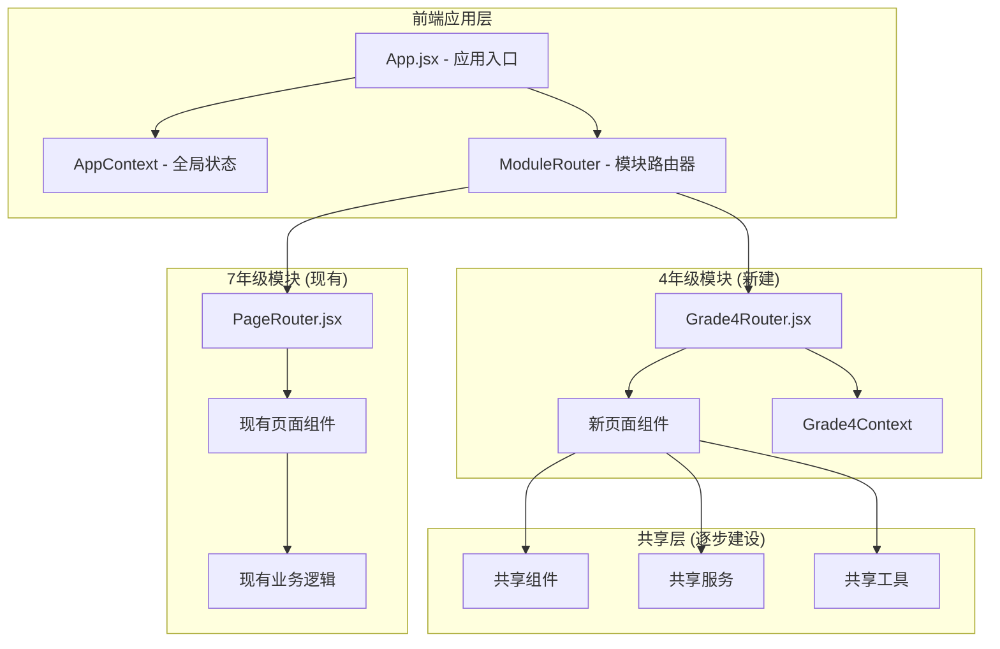
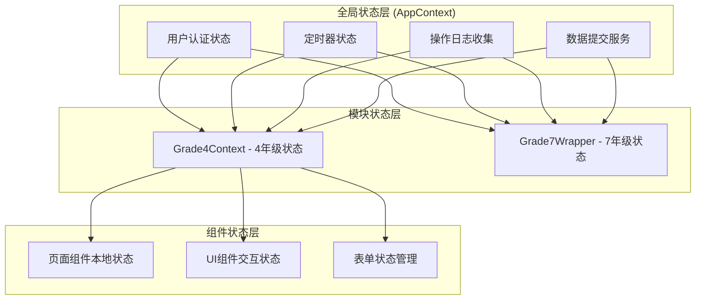
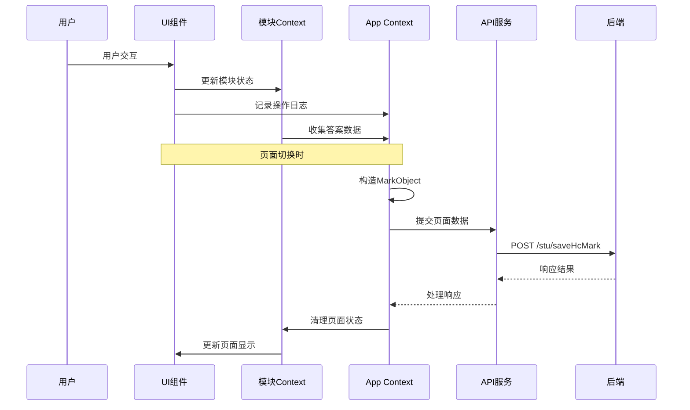
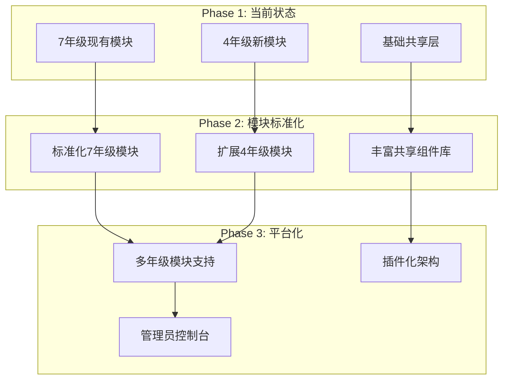

# **前端架构总纲 (Frontend Architecture Overview)**

## **项目整体架构 (Overall Project Architecture)**

### **系统概述**
HCI-Evaluation是一个基于React的教育评估平台，正在从单一7年级模块系统演进为支持多年级评估的模块化架构。本文档提供整个前端系统的鸟瞰视图。

### **核心技术栈**
```
技术栈组合:
├── 构建工具: Vite
├── 前端框架: React (函数式组件 + Hooks)
├── 状态管理: React Context API
├── 样式系统: CSS Modules + CSS Variables
├── 包管理: PNPM
├── 语言: JavaScript/JSX (可选TypeScript)
└── 路由: 自定义路由系统
```

## **1. 架构演进策略 (Architecture Evolution Strategy)**

### **1.1 当前阶段：混合架构**



### **1.2 目录结构全景**

```
steamed-bun-task/
├── public/                         # 静态资源
├── src/
│   ├── components/                 # 【现有】7年级组件 - 保持不变
│   ├── context/                    # 【现有】全局状态管理
│   │   └── AppContext.jsx         # 全局认证、定时器、数据日志
│   ├── pages/                      # 【现有】7年级页面 - 保持不变
│   ├── services/                   # 【现有】API服务 - 逐步迁移
│   ├── styles/                     # 【现有】全局样式
│   ├── utils/                      # 【现有】工具函数
│   ├── modules/                    # 【新】模块系统
│   │   ├── ModuleRegistry.js      # 模块注册中心
│   │   ├── ModuleRouter.jsx       # 顶层模块路由
│   │   ├── ErrorBoundary.jsx      # 错误边界
│   │   ├── grade-7/               # 7年级包装器
│   │   │   ├── index.jsx          # 模块入口
│   │   │   ├── wrapper.jsx        # PageRouter包装
│   │   │   └── config.js          # 模块配置
│   │   └── grade-4/               # 4年级新模块
│   │       ├── assets/            # 模块专用资源
│   │       ├── components/        # 模块专用组件
│   │       │   ├── containers/    # 智能组件
│   │       │   ├── ui/            # 展示组件
│   │       │   └── layout/        # 布局组件
│   │       ├── context/           # Grade4Context状态管理
│   │       ├── hooks/             # 自定义Hooks
│   │       ├── pages/             # 11个评估页面
│   │       ├── utils/             # 模块工具函数
│   │       ├── styles/            # 模块样式
│   │       └── index.jsx          # 模块主入口
│   └── shared/                     # 【新】共享代码层
│       ├── components/            # 跨模块复用组件
│       ├── services/              # 统一API服务
│       ├── hooks/                 # 共享自定义Hooks
│       ├── utils/                 # 共享工具函数
│       └── types/                 # TypeScript类型定义
├── docs/                          # 架构文档
│   └── architecture/              # 本文档所在目录
├── package.json                   # 项目配置
├── vite.config.js                 # Vite配置（路径别名）
└── CLAUDE.md                      # 开发指南
```

## **2. 核心架构组件 (Core Architecture Components)**

### **2.1 应用入口层 (Application Entry Layer)**

```jsx
// src/App.jsx - 应用主入口
import React from 'react';
import { AppProvider } from './context/AppContext';
import ModuleRouter from './modules/ModuleRouter';
import ErrorBoundary from './modules/ErrorBoundary';
import UserInfoBar from './components/common/UserInfoBar';
import Timer from './components/common/Timer';

function App() {
  return (
    <ErrorBoundary>
      <AppProvider>
        <div className="app-container">
          {/* 全局UI框架 */}
          <UserInfoBar />
          <Timer />
          
          {/* 模块路由区域 */}
          <div className="main-content-wrapper">
            <ModuleRouter />
          </div>
        </div>
      </AppProvider>
    </ErrorBoundary>
  );
}

export default App;
```

### **2.2 模块路由系统 (Module Routing System)**

```jsx
// src/modules/ModuleRouter.jsx - 核心模块路由器
import React, { useState, useEffect } from 'react';
import { useAppContext } from '../context/AppContext';
import ModuleRegistry from './ModuleRegistry';

const ModuleRouter = () => {
  const { userContext, isAuthenticated } = useAppContext();
  const [currentModule, setCurrentModule] = useState(null);
  const [moduleComponent, setModuleComponent] = useState(null);

  useEffect(() => {
    if (isAuthenticated && userContext.url) {
      // 根据服务器返回的URL确定模块
      const moduleId = ModuleRegistry.getModuleByUrl(userContext.url);
      loadModule(moduleId);
    }
  }, [isAuthenticated, userContext.url]);

  const loadModule = async (moduleId) => {
    try {
      setCurrentModule(moduleId);
      const ModuleComponent = await ModuleRegistry.loadModule(moduleId);
      setModuleComponent(() => ModuleComponent);
    } catch (error) {
      console.error('模块加载失败:', error);
      // 回退到7年级模块
      loadModule('grade-7');
    }
  };

  if (!isAuthenticated) {
    return <LoginPage />;
  }

  if (!moduleComponent) {
    return <LoadingSpinner />;
  }

  return React.createElement(moduleComponent);
};

export default ModuleRouter;
```

### **2.3 模块注册中心 (Module Registry)**

```javascript
// src/modules/ModuleRegistry.js - 模块注册与管理
class ModuleRegistry {
  static modules = {
    'grade-7': {
      url: '/seven-grade',
      displayName: '7年级蒸馒头科学探究',
      loader: () => import('./grade-7/index.jsx'),
      config: {
        timers: { mainTask: 40, questionnaire: 10 },
        totalPages: 28
      }
    },
    'grade-4': {
      url: '/four-grade', 
      displayName: '4年级火车购票评估',
      loader: () => import('./grade-4/index.jsx'),
      config: {
        timers: { mainTask: 35 },
        totalPages: 11
      }
    }
  };

  static urlToModuleMap = {
    '/seven-grade': 'grade-7',
    '/four-grade': 'grade-4'
  };

  static getModuleByUrl(url) {
    return this.urlToModuleMap[url] || 'grade-7';
  }

  static async loadModule(moduleId) {
    if (!this.modules[moduleId]) {
      throw new Error(`未知模块: ${moduleId}`);
    }

    const module = await this.modules[moduleId].loader();
    return module.default;
  }

  static getModuleConfig(moduleId) {
    return this.modules[moduleId]?.config || {};
  }
}

export default ModuleRegistry;
```

## **3. 状态管理架构 (State Management Architecture)**

### **3.1 多层状态管理体系**



### **3.2 全局状态管理 (Global State Management)**

```jsx
// src/context/AppContext.jsx - 全局状态管理
import React, { createContext, useContext, useReducer, useEffect } from 'react';

const AppContext = createContext();

const initialState = {
  // 认证状态
  isAuthenticated: false,
  userContext: {
    batchCode: '',
    examNo: '',
    url: '',
    userName: ''
  },
  
  // 定时器状态
  timer: {
    startTime: null,
    duration: 0,
    remaining: 0,
    isActive: false,
    warnings: []
  },
  
  // 数据收集状态
  dataCollection: {
    operationList: [],
    answerList: [],
    currentPageData: {}
  },
  
  // 系统状态
  system: {
    currentModule: null,
    isLoading: false,
    errors: []
  }
};

function appReducer(state, action) {
  switch (action.type) {
    case 'SET_AUTHENTICATION':
      return {
        ...state,
        isAuthenticated: action.payload.isAuthenticated,
        userContext: action.payload.userContext
      };
      
    case 'UPDATE_TIMER':
      return {
        ...state,
        timer: { ...state.timer, ...action.payload }
      };
      
    case 'LOG_OPERATION':
      return {
        ...state,
        dataCollection: {
          ...state.dataCollection,
          operationList: [...state.dataCollection.operationList, action.payload]
        }
      };
      
    case 'COLLECT_ANSWER':
      return {
        ...state,
        dataCollection: {
          ...state.dataCollection,
          answerList: [...state.dataCollection.answerList, action.payload]
        }
      };
      
    default:
      return state;
  }
}

export const AppProvider = ({ children }) => {
  const [state, dispatch] = useReducer(appReducer, initialState);

  // 认证管理
  const login = async (credentials) => {
    try {
      const response = await apiService.login(credentials);
      dispatch({
        type: 'SET_AUTHENTICATION',
        payload: {
          isAuthenticated: true,
          userContext: response.data
        }
      });
    } catch (error) {
      throw new Error('登录失败');
    }
  };

  // 操作日志记录
  const logOperation = (operation) => {
    dispatch({
      type: 'LOG_OPERATION',
      payload: {
        ...operation,
        code: state.dataCollection.operationList.length + 1,
        time: formatTimestamp(new Date())
      }
    });
  };

  // 答案收集
  const collectAnswer = (answer) => {
    dispatch({
      type: 'COLLECT_ANSWER',
      payload: {
        ...answer,
        code: state.dataCollection.answerList.length + 1
      }
    });
  };

  // 页面数据提交
  const submitPageData = async (pageData) => {
    const markObject = {
      ...pageData,
      operationList: state.dataCollection.operationList,
      answerList: state.dataCollection.answerList
    };

    await apiService.submitPageMarkData({
      batchCode: state.userContext.batchCode,
      examNo: state.userContext.examNo,
      mark: markObject
    });

    // 清空当前页面的数据收集
    dispatch({ type: 'CLEAR_PAGE_DATA' });
  };

  const contextValue = {
    ...state,
    login,
    logOperation,
    collectAnswer,
    submitPageData
  };

  return (
    <AppContext.Provider value={contextValue}>
      {children}
    </AppContext.Provider>
  );
};

export const useAppContext = () => {
  const context = useContext(AppContext);
  if (!context) {
    throw new Error('useAppContext must be used within AppProvider');
  }
  return context;
};
```

## **4. 数据流架构 (Data Flow Architecture)**

### **4.1 完整数据流程图**



### **4.2 数据传输标准**

```javascript
// 数据传输规范
const DataTransmissionStandard = {
  // 1. 数据格式标准
  submitFormat: {
    method: 'POST',
    endpoint: '/stu/saveHcMark',
    contentType: 'multipart/form-data',
    payload: {
      batchCode: 'string',    // 必需
      examNo: 'string',       // 必需  
      mark: 'JSON string'     // 必需 - MarkObject序列化
    }
  },

  // 2. MarkObject标准结构
  markObjectSchema: {
    pageNumber: 'string',           // 页码（字符串类型）
    pageDesc: 'string',             // 页面描述
    operationList: 'Operation[]',   // 操作记录数组
    answerList: 'Answer[]',         // 答案记录数组
    beginTime: 'string',            // 开始时间 YYYY-MM-DD HH:mm:ss
    endTime: 'string',              // 结束时间 YYYY-MM-DD HH:mm:ss
    imgList: 'ImageInfo[]'          // 图片列表
  },

  // 3. 时间戳格式标准
  timestampFormat: 'YYYY-MM-DD HH:mm:ss',

  // 4. 错误处理标准
  errorHandling: {
    401: '会话过期，重新认证',
    500: '服务器错误，本地缓存并重试',
    timeout: '网络超时，指数退避重试'
  }
};
```

## **5. UI框架架构 (UI Framework Architecture)**

### **5.1 视觉统一框架**

```jsx
// 全局UI框架组件
const GlobalUIFramework = {
  // 顶部用户信息条
  UserInfoBar: {
    position: 'fixed top',
    background: 'linear-gradient(135deg, #4CAF50 0%, #45a049 100%)',
    height: '50px',
    zIndex: 1000,
    content: ['平台名称', '用户姓名']
  },

  // 计时器组件  
  Timer: {
    position: 'fixed top-right',
    background: 'var(--cartoon-secondary)',
    borderRadius: '30px',
    border: '2px solid #ffb347',
    zIndex: 999
  },

  // 主内容区域
  MainContentArea: {
    display: 'flex',
    flexDirection: 'row',
    background: 'white',
    borderRadius: '20px',
    boxShadow: '0 10px 30px var(--cartoon-shadow)',
    border: '3px solid var(--cartoon-border)'
  },

  // 左侧导航
  LeftNavigation: {
    width: '100px',
    background: 'var(--cartoon-light)',
    content: '圆形进度导航'
  },

  // 中央内容卡片
  CentralContentCard: {
    flexGrow: 1,
    borderLeft: '2px solid var(--cartoon-border)',
    borderRadius: '18px',
    padding: '20px'
  }
};
```

### **5.2 CSS变量系统**

```css
/* 全局CSS变量系统 */
:root {
  /* 主色系 */
  --cartoon-primary: #59c1ff;     /* 主要交互色 */
  --cartoon-secondary: #ffce6b;   /* 次要强调色 */
  --cartoon-accent: #ff7eb6;      /* 强调色 */
  
  /* 背景色系 */
  --cartoon-bg: #fff9f0;          /* 全局背景 */
  --cartoon-light: #e6f7ff;       /* 浅色背景 */
  
  /* 功能色系 */
  --cartoon-green: #67d5b5;       /* 成功状态 */
  --cartoon-red: #ff8a80;         /* 错误状态 */
  --cartoon-dark: #2d5b8e;        /* 主要文本 */
  
  /* 装饰色系 */
  --cartoon-border: #ffd99e;      /* 边框色 */
  --cartoon-shadow: rgba(255, 188, 97, 0.3); /* 阴影色 */
}

/* 用户信息条专用渐变 */
.user-info-gradient {
  background: linear-gradient(135deg, #4CAF50 0%, #45a049 100%);
  color: white;
}
```

## **6. 性能与优化策略 (Performance and Optimization)**

### **6.1 代码分割策略**

```javascript
// 模块级代码分割
const ModuleCodeSplitting = {
  // 1. 模块懒加载
  lazyLoadModules: {
    'grade-7': () => import('./modules/grade-7/index.jsx'),
    'grade-4': () => import('./modules/grade-4/index.jsx')
  },

  // 2. 页面级懒加载
  lazyLoadPages: {
    'TimePlanningPage': React.lazy(() => 
      import('./modules/grade-4/pages/TimePlanningPage')
    ),
    'RouteAnalysisPage': React.lazy(() => 
      import('./modules/grade-4/pages/RouteAnalysisPage')
    )
  },

  // 3. 组件级懒加载
  lazyLoadComponents: {
    'OnScreenKeyboard': React.lazy(() => 
      import('./modules/grade-4/components/ui/OnScreenKeyboard')
    )
  }
};
```

### **6.2 状态优化策略**

```javascript
// 状态管理优化
const StateOptimization = {
  // 1. 使用React.memo避免不必要的重渲染
  memoization: {
    components: 'React.memo(Component)',
    calculations: 'useMemo(() => calculate(data), [data])',
    callbacks: 'useCallback((param) => handler(param), [dependency])'
  },

  // 2. 状态分片
  stateSlicing: {
    global: 'AppContext - 认证、定时器、数据收集',
    module: 'Grade4Context - 模块特定状态',
    local: 'useState - 组件内部状态'
  },

  // 3. 本地缓存策略
  caching: {
    userState: 'localStorage持久化用户状态',
    pageData: 'sessionStorage缓存页面数据',
    failedSubmissions: 'indexedDB存储失败提交'
  }
};
```

## **7. 错误处理与监控 (Error Handling and Monitoring)**

### **7.1 分层错误处理**

```jsx
// 分层错误边界系统
const ErrorBoundarySystem = {
  // 1. 应用级错误边界
  AppErrorBoundary: {
    location: 'App.jsx最外层',
    handles: ['致命错误', '模块加载失败', '系统崩溃'],
    fallback: 'SystemErrorPage'
  },

  // 2. 模块级错误边界  
  ModuleErrorBoundary: {
    location: '每个模块内部',
    handles: ['模块内部错误', '页面组件错误'],
    fallback: 'ModuleErrorPage'
  },

  // 3. 页面级错误处理
  PageErrorHandling: {
    location: '页面组件内部',
    handles: ['数据验证错误', '网络请求失败'],
    fallback: 'ErrorMessage + 重试按钮'
  }
};
```

### **7.2 监控与日志系统**

```javascript
// 监控系统架构
const MonitoringSystem = {
  // 1. 错误监控
  errorTracking: {
    clientErrors: 'window.onerror + unhandledrejection',
    componentErrors: 'ErrorBoundary.componentDidCatch',
    apiErrors: 'axios interceptors'
  },

  // 2. 性能监控
  performanceTracking: {
    loadTimes: 'performance.timing API',
    memoryUsage: 'performance.memory',
    renderTimes: 'React DevTools Profiler'
  },

  // 3. 用户行为分析
  userAnalytics: {
    pageViews: 'logOperation记录',
    interactionPaths: '用户操作序列分析',
    completionRates: '评估完成统计'
  }
};
```

## **8. 开发与部署流程 (Development and Deployment)**

### **8.1 开发环境配置**

```javascript
// 开发环境配置
const DevelopmentSetup = {
  // 1. 本地开发配置
  localDev: {
    port: 3000,
    proxy: '/stu -> 后端服务器',
    hotReload: '启用',
    sourceMaps: '详细模式'
  },

  // 2. Vite配置
  viteConfig: {
    alias: {
      '@/services': '/src/shared/services',
      '@/shared': '/src/shared',
      '../services/apiService': '/src/shared/services/apiService.js'
    },
    build: {
      rollupOptions: {
        output: {
          manualChunks: '模块分离'
        }
      }
    }
  },

  // 3. 环境变量
  envVariables: {
    development: '.env.development',
    production: '.env.production',
    apiMode: 'direct | proxy | sameOrigin'
  }
};
```

### **8.2 部署策略**

```javascript
// 部署配置
const DeploymentStrategy = {
  // 1. 构建优化
  buildOptimization: {
    codesplitting: '按模块分割',
    treeshaking: '移除死代码',
    compression: 'gzip + brotli',
    bundleAnalysis: 'webpack-bundle-analyzer'
  },

  // 2. 渐进式部署
  progressiveDeployment: {
    phase1: '新模块功能开关关闭',
    phase2: '小范围用户测试',
    phase3: '全量发布',
    rollback: '一键回退机制'
  },

  // 3. CDN策略
  cdnStrategy: {
    staticAssets: '图片、字体文件',
    jsChunks: '按模块缓存',
    versionControl: '基于hash的版本控制'
  }
};
```

## **9. 总结与未来规划 (Summary and Future Plans)**

### **9.1 当前架构优势**

1. **渐进式演进**: 在不破坏现有功能的前提下逐步引入新架构
2. **模块化设计**: 每个年级模块独立开发和维护
3. **共享代码复用**: 通过shared层减少重复代码
4. **统一视觉风格**: 保持用户体验的一致性
5. **灵活的状态管理**: 多层次状态管理满足不同需求

### **9.2 未来架构规划**



### **9.3 技术债务与改进计划**

```javascript
const TechnicalDebtPlan = {
  shortTerm: [
    '完成4年级模块开发',
    '建立自动化测试',
    '性能优化',
    '错误监控完善'
  ],
  
  mediumTerm: [
    '7年级模块重构',
    'TypeScript迁移',
    '组件库标准化',
    'API接口统一'
  ],
  
  longTerm: [
    '微前端架构演进',
    '服务端渲染支持',
    '离线功能支持',
    '国际化支持'
  ]
};
```

### **9.4 关键成功指标**

```javascript
const SuccessMetrics = {
  技术指标: {
    'Bundle Size': '< 500KB per module',
    'First Paint': '< 1.5s',
    'Error Rate': '< 0.1%',
    'Test Coverage': '> 80%'
  },
  
  用户体验: {
    '页面加载时间': '< 2s',
    '交互响应时间': '< 100ms',
    '数据提交成功率': '> 99.9%',
    '用户满意度': '> 4.5/5'
  },
  
  开发效率: {
    '新模块开发周期': '< 2周',
    'Bug修复时间': '< 24小时',
    '代码审查周期': '< 2天',
    '部署频率': '每周1次'
  }
};
```

这个前端架构总纲为整个系统提供了完整的技术蓝图，确保所有开发工作都在统一的架构框架下进行，实现高质量、可维护、可扩展的教育评估平台。