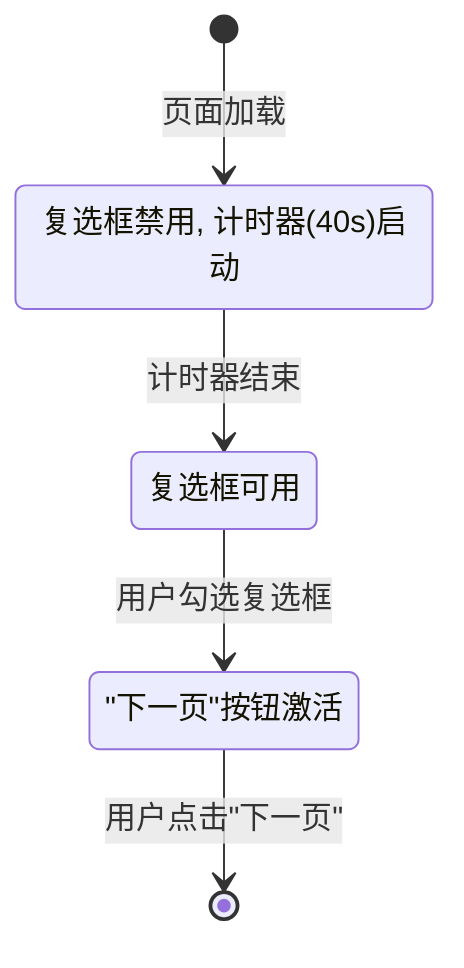

# 故事 2.1: 模块骨架与引导页 (Module Skeleton & Guide Page)

**状态**: Done  
**史诗**: 2. "火车购票"测评模块  
**优先级**: High  
**估算**: 5 story points  
**创建时间**: 2025-07-27  

## 故事内容

**用户故事**: 作为一个开发者，我想要为四年级模块创建基本的目录结构，并精确实现"注意事项"页面，包括其40秒强制阅读计时器，确保视觉风格与现有7年级模块完全一致。

**业务价值**: 
- 为新的四年级模块建立清晰的代码组织结构
- 实现首个评估页面，确立新模块的UI和交互模式
- 验证新模块系统的基础功能和集成能力
- 为后续页面开发提供标准的组件模板和架构范式

## 验收标准

- [ ] **AC1**: src/modules/grade-4/ 目录下成功创建了 pages, components, assets 等子目录
  - 创建标准的模块目录结构
  - 包含必要的子目录：pages/, components/, context/, assets/, utils/, styles/
  - 目录结构符合架构规范中定义的模块组织方式

- [ ] **AC2**: 成功创建并渲染了"注意事项"页面，遵循强制阅读与确认流程规范
  - 页面布局严格遵循现有7年级模块的视觉架构
  - 使用统一的CSS变量系统和组件样式
  - 包含测评注意事项说明文本，涵盖时间限制、操作规则等重要信息
  - 复选框标签为"我已阅读并同意以上注意事项"

- [ ] **AC3**: 页面加载时，标签为"我已阅读上述注意事项(40s)"的复选框处于禁用状态，并启动一个40秒的倒计时
  - 复选框初始状态为禁用
  - 40秒倒计时器正确启动
  - 倒计时器显示格式正确

- [ ] **AC4**: 倒计时期间，标签中的秒数动态更新
  - 秒数显示实时更新
  - 倒计时显示格式为"(Xs)"格式
  - 倒计时平滑流畅，无卡顿

- [ ] **AC5**: 倒计时结束后，标签中的秒数文本消失，复选框变为可用状态
  - 倒计时结束时秒数文本正确移除
  - 复选框状态正确转为可用
  - 状态转换无延迟或错误

- [ ] **AC6**: 用户勾选复选框后，"下一页"按钮被激活
  - 复选框勾选事件正确处理
  - "下一页"按钮状态正确切换
  - 按钮点击能够正确导航到下一页

## 任务分解

### Task 1: 创建4年级模块目录结构 (AC: 1)
- [ ] 在 src/modules/grade-4/ 下创建标准目录结构
- [ ] 创建 pages/ 目录用于存放页面组件
- [ ] 创建 components/ 目录，包含 containers/, ui/, layout/ 子目录
- [ ] 创建 context/ 目录用于状态管理
- [ ] 创建 assets/ 目录用于模块专用资源
- [ ] 创建 utils/ 目录用于工具函数
- [ ] 创建 styles/ 目录用于模块样式

### Task 2: 建立模块状态管理系统 (AC: 6)
- [ ] 创建 Grade4Context.jsx 状态管理文件
- [ ] 实现模块初始状态定义
- [ ] 实现状态更新和持久化逻辑
- [ ] 创建 useGrade4Context Hook

### Task 3: 创建页面布局组件 (AC: 2)
- [ ] 创建 AssessmentPageLayout.jsx 布局组件
- [ ] 实现统一的页面结构和导航
- [ ] 集成现有的视觉风格和CSS变量系统
- [ ] 确保组件符合编码标准规范

### Task 4: 实现注意事项页面核心功能 (AC: 2, 3, 4, 5)
- [ ] 创建 OnboardingPage.jsx 页面组件，遵循UI/UX设计规范
- [ ] 实现页面内容布局：
  - [ ] 使用统一的CSS变量系统和组件样式
  - [ ] 添加测评注意事项说明文本（时间限制、操作规则等）
  - [ ] 确保内容在一屏内完成，不出现滚动条
- [ ] 实现40秒倒计时功能：
  - [ ] 倒计时器状态管理（40秒 -> 0秒）
  - [ ] 实时更新标签中的秒数显示"(40s)"格式
  - [ ] 倒计时结束时移除秒数文本
- [ ] 实现复选框状态控制逻辑：
  - [ ] 初始状态为禁用(disabled)，使用自定义样式
  - [ ] 40秒后自动变为可用(enabled)状态
  - [ ] 标签文本："我已阅读并同意以上注意事项"
- [ ] 实现"下一页"按钮控制：
  - [ ] 初始状态禁用，使用标准按钮样式
  - [ ] 复选框勾选后激活，应用悬停效果
- [ ] 集成页面生命周期管理（进入/退出日志）

### Task 5: 实现页面导航和数据收集 (AC: 6)
- [ ] 实现"下一页"按钮激活逻辑
- [ ] 集成操作日志记录系统
- [ ] 实现答案收集功能
- [ ] 实现页面切换和状态管理

### Task 6: 模块集成和验证 (All ACs)
- [ ] 在 ModuleRegistry.js 中注册4年级模块
- [ ] 创建模块主入口文件 index.jsx
- [ ] 验证模块在整体应用中的正确加载
- [ ] 测试与现有系统的兼容性

## 开发笔记

### 前一故事的关键洞察

从故事 1.5 的实施中获得的重要技术洞察：

1. **多模块系统已激活** [Source: docs/stories/1.5.activate-new-module-system.md#开发代理记录]:
   - ModuleRouter 已成功集成到 App.jsx 中
   - 模块路由基于 moduleUrl 状态工作
   - ModuleRegistry 支持动态模块加载
   - 新模块可以直接通过注册表集成

2. **架构集成已就绪** [Source: docs/stories/1.5.activate-new-module-system.md#核心架构变更]:
   - 全局状态通过 globalContext 传递给模块
   - 认证信息通过 authInfo 传递
   - 模块可以访问 logOperation 和 collectAnswer 函数

### UI/UX设计规范

**视觉一致性要求** [Source: docs/ui-ux-spec/introduction.md#品牌与风格指南]:

必须严格遵循现有7年级模块的视觉架构：

**页面布局标准**:
```css
/* 顶部用户信息条 - 保持现有样式 */
.user-info-bar {
  background: linear-gradient(135deg, #4CAF50 0%, #45a049 100%);
  position: fixed;
  top: 0;
  height: 50px;
  color: white;
}

/* 主应用区域 */
.main-application-area {
  background: var(--cartoon-bg); /* #fff9f0 */
  padding-top: 50px; /* 为顶部信息条预留空间 */
}

/* 中央内容卡片 */
.central-content-card {
  background: white;
  border-radius: 20px;
  border: 3px solid var(--cartoon-border); /* #ffd99e */
  box-shadow: 0 10px 30px var(--cartoon-shadow);
  padding: 20px;
  /* 关键要求：所有内容必须在一屏内完成，不出现滚动条 */
  max-height: calc(100vh - 150px);
  overflow: hidden;
}
```

**CSS变量系统** [Source: docs/ui-ux-spec/introduction.md#色彩方案]:
```css
:root {
  /* 主色系 */
  --cartoon-primary: #59c1ff;    /* 主要交互色，导航高亮 */
  --cartoon-secondary: #ffce6b;  /* 次要强调色，计时器背景 */
  --cartoon-accent: #ff7eb6;     /* 强调色，按钮激活状态 */
  
  /* 背景色系 */
  --cartoon-bg: #fff9f0;         /* 全局背景 */
  --cartoon-light: #e6f7ff;      /* 左侧导航背景 */
  
  /* 功能色系 */
  --cartoon-green: #67d5b5;      /* 成功/已完成状态 */
  --cartoon-red: #ff8a80;        /* 警告/错误状态 */
  --cartoon-dark: #2d5b8e;       /* 主要文本色 */
  
  /* 装饰色系 */
  --cartoon-border: #ffd99e;     /* 边框色 */
  --cartoon-shadow: rgba(255, 188, 97, 0.3); /* 阴影色 */
}
```

**组件样式标准** [Source: docs/ui-ux-spec/introduction.md#组件样式]:
```css
/* 按钮样式 */
.btn {
  padding: 12px 24px;
  border-radius: 12px;
  border: none;
  font-size: 16px;
  cursor: pointer;
}

.btn-primary {
  background: var(--cartoon-primary);
  color: white;
  transition: transform 0.2s;
}

.btn-primary:hover {
  transform: translateY(-3px);
}

.btn:disabled {
  background: #cccccc;
  color: #888888;
  cursor: not-allowed;
}

/* 页面标题 */
.page-title {
  font-size: 24px;
  color: var(--cartoon-dark);
  border-bottom: 4px solid var(--cartoon-secondary);
  padding-bottom: 8px;
  margin-bottom: 20px;
}

/* 复选框自定义样式 */
.custom-checkbox {
  display: flex;
  align-items: center;
  margin: 20px 0;
}

.custom-checkbox input[type="checkbox"] {
  width: 20px;
  height: 20px;
  margin-right: 12px;
  accent-color: var(--cartoon-primary);
}

.custom-checkbox input[type="checkbox"]:disabled {
  opacity: 0.5;
  cursor: not-allowed;
}
```

**强制阅读交互流程** [Source: docs/ui-ux-spec/user-flows.md#强制阅读与确认]:

必须按照以下精确的交互状态图实现：


**详细交互步骤规范**:
1. **初始状态**: 复选框处于**禁用 (disabled)** 状态，"下一页"按钮也处于**禁用**状态，40秒计时器启动
2. **倒计时显示**: 复选框标签显示"我已阅读并同意以上注意事项(40s)"，秒数实时倒数更新
3. **状态变更**: 40秒结束后，标签中的秒数文本消失，复选框变为**可用 (enabled)**
4. **确认操作**: 用户勾选复选框后，"下一页"按钮从禁用变为**启用 (enabled)**
5. **导航**: 点击"下一页"进入下一个页面，此时35分钟主计时器正式启动

**注意事项页面内容规范** [Source: docs/ui-ux-spec/user-flows.md#强制阅读与确认]:

页面必须包含以下内容：
- **页面标题**: "测评注意事项"
- **主要内容**: 测评注意事项说明文本，包括：
  - 时间限制说明（35分钟总时长）
  - 操作规则（单向流程、不可返回等）
  - 重要提示信息
- **交互元素**:
  - 复选框：初始禁用，标签含倒计时
  - "下一页"按钮：初始禁用，位于页面底部居中或右下角
- **视觉要求**:
  - 使用 --cartoon-bg 背景色
  - 中央内容卡片使用白色背景和标准边框
  - 所有元素符合现有视觉规范

**倒计时器实现细节**:
```javascript
// 倒计时器Hook示例
const useReadingTimer = (duration = 40) => {
  const [timeLeft, setTimeLeft] = useState(duration);
  const [isCompleted, setIsCompleted] = useState(false);

  useEffect(() => {
    if (timeLeft > 0) {
      const timer = setTimeout(() => {
        setTimeLeft(timeLeft - 1);
      }, 1000);
      return () => clearTimeout(timer);
    } else {
      setIsCompleted(true);
    }
  }, [timeLeft]);

  return { timeLeft, isCompleted };
};
```

### 技术实现要点

**模块目录结构** [Source: docs/architecture/source-tree.md#分阶段目录结构]:

必须创建的目录结构：
```
src/modules/grade-4/
├── assets/         # 图片、SVG等静态资源
├── components/     # 模块专用React组件
│   ├── containers/ # 智能组件（含状态逻辑）
│   ├── ui/         # 纯展示组件
│   └── layout/     # 布局组件
├── context/        # Grade4Context.jsx状态管理
├── hooks/          # 模块专用自定义Hooks
├── pages/          # 11个测评页面组件
├── utils/          # 工具函数
├── styles/         # 模块样式
└── index.jsx       # 四年级模块主入口
```

**状态管理架构** [Source: docs/architecture/data-models.md#内部UI状态模型]:

Grade4Context 必须实现的状态结构：
```javascript
const initialState = {
  currentPage: 1,
  problemStatement: '',
  relevantFactors: [],
  routeCalculations: {
    route1_km: null,
    route5_km: null
  },
  stationChoice: {
    station: null,
    justification: ''
  },
  userSchedules: {
    scheme1: { tasks: [], totalTime: null },
    scheme2: { tasks: [], totalTime: null }
  },
  optimizationResponse: {
    isOptimal: null,
    improvedPlan: undefined
  },
  preliminarySelection: [],
  finalPurchaseDecision: {
    selectedTrain: null,
    justification: '',
    calculationFormula: '',
    calculatedTotal: null
  }
};
```

**页面组件标准** [Source: docs/architecture/coding-standards.md#标准页面组件模板]:

所有页面组件必须遵循的结构：
```jsx
import React, { useEffect } from 'react';
import { useAppContext } from '../../../context/AppContext';
import { useGrade4Context } from '../context/Grade4Context';

const NewModulePage = () => {
  const { 
    isAuthenticated,
    logOperation,
    collectAnswer
  } = useAppContext();
  
  const { currentPage, updateCurrentPage } = useGrade4Context();

  useEffect(() => {
    logOperation({
      targetElement: '页面',
      eventType: 'page_enter',
      value: `进入页面${currentPage}`
    });
  }, []);

  const handleNextPage = () => {
    collectAnswer({
      targetElement: '问题标识',
      value: '用户的答案'
    });
    
    updateCurrentPage(currentPage + 1);
  };

  return (
    <div className="page-content">
      <div className="page-title">页面标题</div>
      <div className="cartoon-box">
        {/* 页面具体内容在这里 */}
        <button 
          className="btn btn-primary"
          onClick={handleNextPage}
        >
          下一页
        </button>
      </div>
    </div>
  );
};

export default NewModulePage;
```

### 架构约束和依赖

**技术栈约束** [Source: docs/architecture/tech-stack.md]:
- 必须使用现有的 React + JavaScript 技术栈
- 禁止引入任何新的核心框架或库
- 必须使用 React Context API 进行状态管理
- 组件必须使用函数式组件和 Hooks

**编码规范约束** [Source: docs/architecture/coding-standards.md]:
- 组件文件必须遵循标准组件结构模板
- 导入语句必须按照规定顺序排列
- 必须包含完整的错误处理逻辑
- localStorage 操作必须遵循错误处理规范

**样式系统约束** [Source: docs/architecture/coding-standards.md#必须使用的CSS变量系统]:
- 必须使用定义的CSS变量系统
- 必须使用基础样式类：btn, btn-primary, page-content, page-title, cartoon-box
- 布局必须符合中央内容区域标准
- 禁止使用硬编码样式

### 数据模型和状态传递

**数据提交格式** [Source: docs/architecture/data-models.md#后端提交数据模型]:

页面数据必须遵循的提交格式：
```javascript
const markObject = {
  pageNumber: "1",                     // String: 页面序号
  pageDesc: "注意事项页面",             // String: 页面描述
  operationList: [                     // Array: 用户操作记录
    {
      code: 1,                         // Number: 操作序号
      targetElement: "页面",           // String: 操作目标
      eventType: "page_enter",         // String: 事件类型
      value: "进入页面Page_1",          // String: 操作值
      time: "2024-07-27 15:30:45"     // String: 时间戳
    }
  ],
  answerList: [                        // Array: 答案记录
    {
      code: 1,                         // Number: 答案序号
      targetElement: "注意事项确认",    // String: 问题标识
      value: true                      // Any: 答案值
    }
  ],
  beginTime: "2024-07-27 15:30:45",   // String: 页面进入时间
  endTime: "2024-07-27 15:32:10",     // String: 页面退出时间
  imgList: []                          // Array: 图片附件
};
```

**操作日志记录** [Source: docs/architecture/coding-standards.md#必需的数据记录函数]:

必须实现的操作记录：
```javascript
// 页面进入
logOperation({
  targetElement: '页面',
  eventType: 'page_enter',
  value: '进入注意事项页面'
});

// 倒计时开始
logOperation({
  targetElement: '倒计时器',
  eventType: 'timer_start',
  value: '40秒倒计时开始'
});

// 复选框勾选
logOperation({
  targetElement: '注意事项确认复选框',
  eventType: 'checkbox_change',
  value: 'true'
});

// 按钮点击
logOperation({
  targetElement: '下一页按钮',
  eventType: 'click',
  value: '导航到下一页'
});
```

### 组件集成规范

**模块注册集成** [Source: docs/architecture/frontend-architecture.md#模块注册中心]:

在 ModuleRegistry.js 中注册模块：
```javascript
'grade-4': {
  url: '/four-grade', 
  displayName: '4年级火车购票评估',
  loader: () => import('./grade-4/index.jsx'),
  config: {
    timers: { mainTask: 35 },  // 35分钟总时长
    totalPages: 11
  }
}
```

**模块入口实现** [Source: docs/architecture/coding-standards.md#模块集成标准]:

src/modules/grade-4/index.jsx 必须实现：
```jsx
import React from 'react';
import { Grade4Provider } from './context/Grade4Context';
import Grade4Router from './components/Grade4Router';

const Grade4Module = () => {
  return (
    <Grade4Provider>
      <Grade4Router />
    </Grade4Provider>
  );
};

export default Grade4Module;
```

### API 集成要求

**数据提交集成** [Source: docs/architecture/data-models.md#数据提交标准格式]:

使用现有的数据提交服务：
- 端点: `POST /stu/saveHcMark`
- 格式: FormData (NOT JSON)
- 包含字段: batchCode, examNo, mark (JSON string)

**状态恢复集成** [Source: docs/architecture/core-workflows.md#状态持久化工作流程]:

实现页面状态恢复：
- localStorage 持久化模块状态
- 页面刷新后状态恢复
- 会话管理和错误处理

### 项目结构影响

**新增文件**:
- `src/modules/grade-4/index.jsx` - 模块主入口
- `src/modules/grade-4/context/Grade4Context.jsx` - 状态管理
- `src/modules/grade-4/components/layout/AssessmentPageLayout.jsx` - 布局组件
- `src/modules/grade-4/pages/OnboardingPage.jsx` - 注意事项页面
- `src/modules/grade-4/components/Grade4Router.jsx` - 模块路由器

**修改文件**:
- `src/modules/ModuleRegistry.js` - 添加grade-4模块注册

**依赖文件** (无需修改，但需验证兼容性):
- `src/modules/ModuleRouter.jsx` - 顶层模块路由器
- `src/context/AppContext.jsx` - 全局状态管理
- `src/App.jsx` - 应用入口

### 性能考虑

**代码分割** [Source: docs/architecture/frontend-architecture.md#代码分割策略]:

模块采用懒加载：
- 模块级代码分割通过 import() 实现
- 页面级组件可选择性懒加载
- 大型组件使用 React.lazy 包装

**状态管理优化** [Source: docs/architecture/frontend-architecture.md#状态优化策略]:

- 使用 React.memo 避免不必要重渲染
- 使用 useMemo 缓存计算结果
- 使用 useCallback 缓存事件处理函数
- 本地状态持久化到 localStorage

## 测试策略

### 测试方法

**单元测试**:
- OnboardingPage 组件的渲染测试
- UI/UX视觉一致性测试（CSS变量使用、组件样式）
- 倒计时器功能测试（40秒倒计时、文本更新、状态切换）
- 复选框状态控制测试（禁用/启用状态、样式变化）
- 按钮状态测试（禁用/启用切换、悬停效果）
- 数据收集和状态管理测试

**集成测试**:
- Grade4Context 与页面组件的集成测试
- 与 AppContext 的状态交互测试
- 模块路由和加载测试

**功能测试**:
- 完整的注意事项页面用户流程测试
- 倒计时和页面导航功能测试

### 测试标准

**测试文件位置和命名约定** [Source: docs/architecture/coding-standards.md]:

```
src/modules/grade-4/
├── __tests__/                          # 测试文件目录
│   ├── OnboardingPage.test.jsx         # 页面组件测试
│   ├── Grade4Context.test.jsx          # 状态管理测试
│   └── integration/                    # 集成测试
│       └── ModuleIntegration.test.jsx  # 模块集成测试
```

**测试框架和模式**:
- 使用 **Vitest** 作为测试运行器
- 使用 `@testing-library/react` 进行组件渲染和交互测试
- Mock 全局 AppContext 进行隔离测试

**测试覆盖要求**:
- 所有新增组件必须有单元测试
- 关键用户交互流程必须有集成测试
- 倒计时器和状态管理必须有专门测试

**测试运行和验证**:
```bash
npm run test                    # 运行所有测试
npm run lint                   # 代码质量检查
npm run build                  # 构建验证
```

### 必须验证的关键行为

1. **目录结构创建**: 确认所有必需目录和文件正确创建
2. **模块注册**: 验证模块在 ModuleRegistry 中正确注册
3. **视觉一致性**: 验证页面样式与7年级模块完全一致
4. **倒计时功能**: 验证40秒倒计时正确工作，包括：
   - 计时器准确倒数
   - 标签文本实时更新
   - 倒计时结束后状态正确切换
5. **交互流程**: 验证强制阅读流程严格按照规范执行
6. **状态管理**: 验证 Grade4Context 正确管理页面状态
7. **数据记录**: 验证操作日志和答案收集正确工作

## 变更日志

| 日期 | 版本 | 描述 | 作者 |
|------|------|------|------|
| 2025-07-27 | 1.0 | 初始故事创建，基于Epic 2.1需求和完整架构分析 | Bob (Scrum Master) |
| 2025-07-27 | 1.1 | 重大更新：基于UI/UX规范文档补充详细的视觉设计要求、交互流程规范和注意事项页面具体内容 | Bob (Scrum Master) |